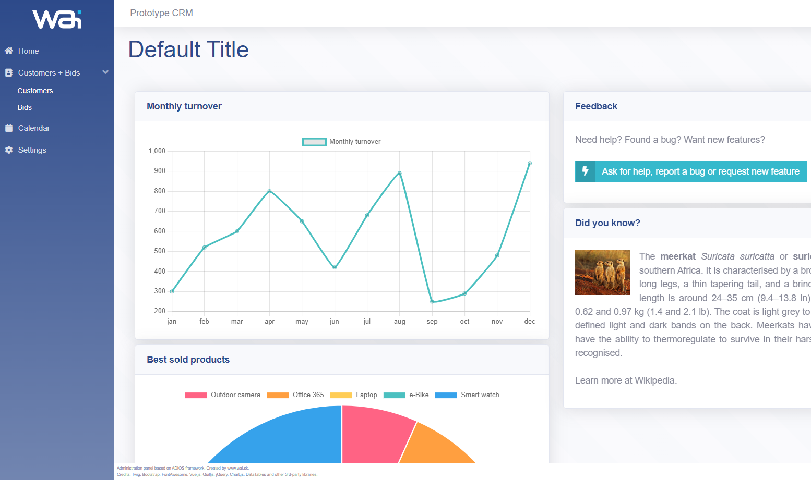
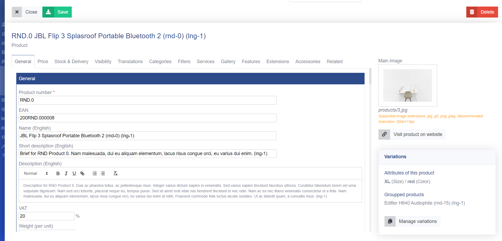
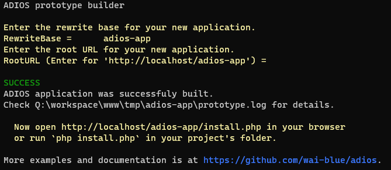

# ADIOS

Light-weight rapid application development framework for PHP 8.

Easy to use and completely free.

## Why ADIOS?

ADIOS is a framework with a **small footprint**. With only a little coding, you can create application with complete CRUD functionality, containing complex inputs (like dates, WYSIWYG editors or autocomplete) and able to manage complex data structures.

You do not need to waste time configuring the router. Simply create a file and the **routing table will update automatically**.

You do not need to import UI components for the CRUD operations. **UI/Table and UI/Form components are in-built.**

You can very easily create very complex forms, thanks to the **strong form templating engine**. Tabs, grids, inputs, dashboards, ... it's done in few lines of code.

And you can fully customize your application.

### ADIOS vs LARAVEL

| ADIOS                                                                                                | Laravel                                                                                                                                    |
|------------------------------------------------------------------------------------------------------|--------------------------------------------------------------------------------------------------------------------------------------------|
| Can be built easily using a json file                                                                | Requires additional configuration and libraries to reach the functionality which ADIOS offers out of the box                               |
| Developed with CRM in mind                                                                           | Built with focus on broad usage in diverse applications                                                                                    |
| Folder structure is straight-forward and easy to understand (1 main directory with 6 folders inside) | Folders are complexely structured to make it better for developing large applications (2 main directories with 22 folders in total inside) |
| 0.068 ms per request                                                                                 | 12.223 ms per request                                                                                                                      |

When building an identical CRM applications with both of these frameworks, ADIOS takes up only 14,5 MB (14,1 MB dependencies) of space, while Laravel 10 needs 240 MB (150,3 MB dependencies).

## Screenshots


**Sample dashboard in ADIOS app**


**Complex form for managing e-commerce product (taken from https://www.surikata.io)**

## Features

  * Small footprint
  * [Bootstrap](https://getbootstrap.com)-based user interface
  * In-built configuration management
  * In-built models for user management, permissions and ACL
  * In-built routing
  * Multi-language support
  * Skinnable
  * Full-featured set of in-built UI components (tables, forms, tabs, inputs, charts, dashboard, ...)
  * Strong form-templating engine
  * Flexible templating engine thanks to [Twig](https://twig.symfony.com)
  * In-built database relationships (1:N and M:N) management
  * Compatible with Laravel's [Eloquent](https://laravel.com/docs/eloquent) and [PDO](https://www.php.net/manual/en/book.pdo.php)
  * Powerful prototype builder
  * Nice formatted exception handling including fatal errors and custom exceptions
  * In-built unit test automation classes

## Create your first CRM application (in a few minutes)

You need only these simple commands to create your first CRM application:

```
composer create-project wai-blue/adios-app
cd adios-app
./bin/build.sh
```



This will create an ADIOS application based on the [simple-crm.json prototype](https://github.com/wai-blue/ADIOS/blob/main/docs/Prototype/examples/10-simple-crm.json) which you can further [customize](https://github.com/wai-blue/ADIOS/blob/main/docs/getting-started.md).

Interested? Read more in [docs/getting-started](docs/getting-started.md).

## Want to contribute?

ADIOS is an open-source MIT licensed framework. You can use it for free for both personal and commercial projects.

We will be happy for any contributions to the project:

  * UI componets
  * Language dictionaries
  * Skins
  * Plugins
  * Prototype builder templates
  * Sample applications
  * Documentation
  * Unit tests
  * And anything else...

Enjoy!

## Want to donate? Buy us a beer.

Thank you :-)
